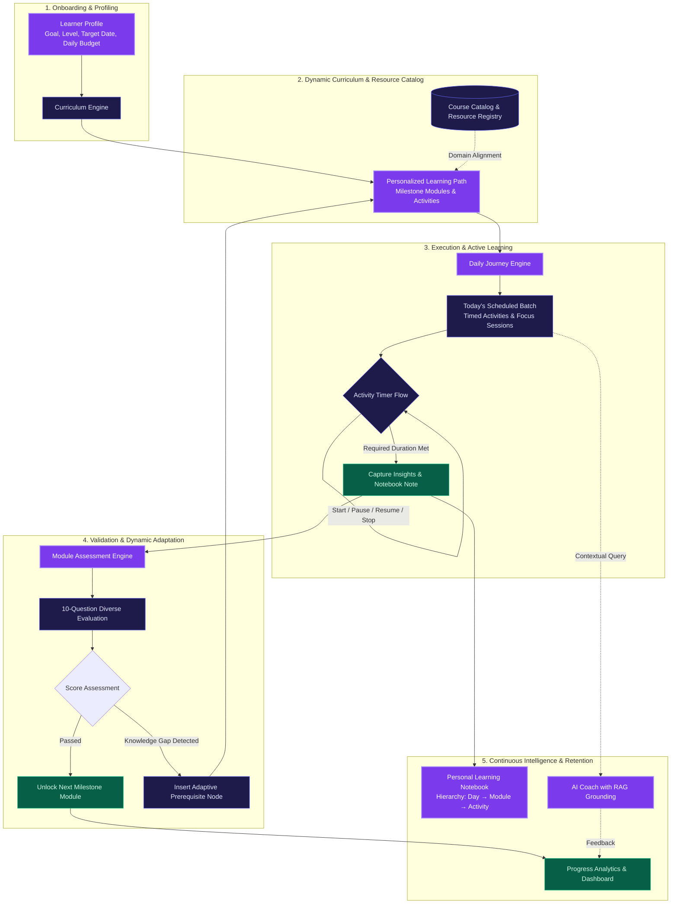

# 🚀 LearnPilot

### A Personalized AI-Powered Adaptive Learning Platform

**AI-powered personalized learning for every learner**

[📄 Solution Document](https://drive.google.com/file/d/1OPannhyR72xPYWoI-Rp0jm9aZC5rCGG9/view?usp=drive_link) ·
[ppt]=https://drive.google.com/file/d/1BYXckDo7lc0fKKO55iY1m-Puo9UoKwc9/view?usp=drive_link
 [🖥️ Live Demo](http://localhost:3000) ·
  [🎥 Demo Video](https://drive.google.com/file/d/1xyisEOYtatN1SO5CDxd2nSJ_p6TV9xTW/view?usp=drive_link)

▶ Continuous, goal-aligned learning with dynamic daily pacing, active knowledge gap detection, contextual assessments, and intelligent AI coaching.

---

> **The one idea.** Traditional online education is rigid, linear, and one-size-fits-all. Learners are handed massive, static course catalogs with predetermined schedules that fail to adapt to individual pacing, real-world schedules, or emergent knowledge gaps. When life happens or a difficult concept stalls momentum, learners fall behind with no intelligent system to recalibrate their path.
>
> LearnPilot transforms learning from a static syllabus into an evolving **orbital learning system**. By grounding every session in the learner's specific career goal, current proficiency, and daily time budget, LearnPilot dynamically orchestrates multi-month curricula into bite-sized **Daily Journeys**. It couples per-activity pacing timers with knowledge-validating **Assessments**, domain-specific **Courses**, an authenticated **RAG-powered AI Coach**, and a contextual **Personal Learning Notebook**.
>
> When a learner completes an activity or demonstrates a knowledge gap during an assessment, the system dynamically introduces prerequisite modules, recalculates milestone forecasts, and reorganizes their daily workload—ensuring that every minute spent learning is directly aligned with their goals.

---

## Contents

[Results / Impact](#-results--impact) ·
[How it works](#-how-it-works) ·
[Demo Account](#-demo-account) ·
[Quickstart](#-quickstart) ·
[Core Experience](#-core-experience) ·
[Personalization / Adaptive Learning](#-personalization--adaptive-learning) ·
[Repo structure](#-repo-structure) ·
[Deliverables](#-deliverables) ·
[Tech stack](#-tech-stack)

---

## 🏆 Results / Impact

* **Personalized Curriculum Generation**: Automatically decomposes high-level career goals (e.g., *Frontend Developer*, *AI Engineer*, *Cloud Architect*) into sequenced, multi-week milestone modules and structured learning activities.
* **Dynamic Daily Pacing**: Converts multi-module learning paths into manageable daily batches strictly calibrated to the learner's available schedule (from 15 to 120+ minutes/day).
* **10-Question Multi-Modal Assessments**: Generates domain-aware evaluations with balanced question typologies—including conceptual MCQs, code analysis, debugging, multi-select, scenario trade-offs, and practical architecture problems.
* **Persistent Progress & Milestone Tracking**: Continuously tracks completed minutes, module mastery percentages, active streaks, and estimated completion targets with Supabase persistence.
* **Contextual Learning Notebook**: Deep-links notes with structured metadata (`Day`, `Module`, `Activity`, `Topic`) featuring live Markdown preview, drag-and-drop image uploads, search, and direct *Open Source* navigation back to journey activities.
* **Ground-Truth RAG AI Coach**: Answers learner questions with authenticated user profile awareness, curriculum grounding, and strict time-constraint adherence powered by Groq Llama 3.3 70B.

---

## 🧠 How it works



---

## 🚀 Quickstart

### Prerequisites
- **Node.js**: `v18.18+` or `v20+`
- **Package Manager**: `npm` or `pnpm`
- **Supabase Account**: A Supabase project with database migrations applied
- **Groq API Key**: For server-side AI Coach chat completions

### 1. Clone & Install Dependencies

```bash
git clone https://github.com/shubhamshevkar2000-maker/Learnpilot_Smashers.git
cd learnpilot

# Install packages
npm install
```

### 2. Configure Environment Variables

Create a `.env.local` file in the project root:

```env
# Supabase Configuration
NEXT_PUBLIC_SUPABASE_URL=https://your-project-ref.supabase.co
NEXT_PUBLIC_SUPABASE_ANON_KEY=your-anon-public-key-here

# Groq AI Coach Configuration
GROQ_API_KEY=your-groq-api-key-here
GROQ_MODEL=llama-3.3-70b-versatile
```

### 3. Apply Database Migrations (Supabase)

Execute the SQL migration scripts in `supabase/migrations/` in order within your Supabase SQL Editor:
1. `20260809000000_learner_schema.sql` (Profiles, Curricula, Modules, Activities)
2. `20260809000001_add_activity_scheduling.sql`
3. `20260810000000_learner_notes.sql` (Notes, Tags, Source Metadata)
4. `20260810000002_add_estimated_minutes.sql`

### 4. Run Development Server

```bash
npm run dev
```

Open [http://localhost:3000](http://localhost:3000) in your browser.

### 5. Seed Demo Account (Optional)

```bash
npm run seed:demo
```

### 6. Build for Production

```bash
npm run build
npm run start
```

---

## 🎮 Demo Account

For rapid evaluation, LearnPilot includes a production-ready, pre-configured demo account with rich learning data:

| Property | Value |
|---|---|
| **Demo Email** | `demo@learnpilot.app` |
| **Demo Password** | `LearnPilot@Demo2026!` |
| **Learner Profile** | Alex Morgan (Full-Stack Web Development, Intermediate, 45 min/day) |
| **One-Click Access** | Click **"🚀 Try Demo Account"** directly on the [`/login`](http://localhost:3000/login) page |

### What's Preloaded:
* **Learning Path**: 8 sequential Full-Stack modules with completed (*Web Fundamentals*, *JS Foundations*), active (*Advanced JS & Async*), and locked modules.
* **Daily Journey**: Calibrated for 45 min/day with real activity timers and completion verification.
* **Assessments**: Completed 10-question evaluations for past modules (90% & 80% scores) and active Module 3 diagnostic checkpoint.
* **Personal Notebook**: 4 tagged technical notes with code snippets, Markdown, and deep-linked source metadata.
* **Progress & AI Coach**: Real-time analytics, skill mastery trends, and context-grounded AI coaching.

---

## 🧭 Core Learning Experience

### 🎯 Learning Path
Builds a cohesive, personalized multi-stage curriculum tailored directly to the learner's onboarding goal and skill level. Modules are hierarchically ordered with sequence dependencies, estimated durations, and completion milestones.

### 📅 Daily Journey
Translates the long-term curriculum into actionable daily learning batches based on the learner's daily time budget. Features:
- **Live Activity Timer**: Dynamic timers with `Start`, `Pause`, `Resume`, and `Stop Session` controls.
- **Duration Gating**: Prevents premature completion until the required activity duration has elapsed.
- **Capture Insights**: Prompts structured note-taking upon activity completion with tags and screenshot attachments.

### 📚 Courses
A curated skill-building resource library that organizes domain topics into modular video, article, and hands-on laboratory resources, independent of the daily linear schedule.

### 🧠 AI Coach
An intelligent, context-aware learning companion. Built with Retrieval-Augmented Generation (RAG), the coach grounds its answers in the learner's specific profile, active curriculum modules, and daily time constraints.

### 📝 Assessments
Adaptive 10-question evaluations generated dynamically per module. Supports 7 distinct question formats:
- Conceptual Multiple Choice
- Code Analysis & Output Prediction
- Code Debugging / Bug Finding
- Multi-Select Checkboxes
- Scenario & Architecture Trade-offs
- True/False with Justifications
- Practical Implementation Questions

### 📓 Personal Learning Notebook
A full-featured learning workspace supporting:
- **Hierarchical Views**: Categorized by `Day` $\rightarrow$ `Topic` $\rightarrow$ `Activity`.
- **Authoring Tools**: Markdown editor, live preview, split view, code blocks, checklists, and compressed image attachments.
- **Contextual Deep Linking**: Includes an *Open Source* action that deep-links directly back to the relevant activity in Daily Journey.

### 📈 Progress Analytics
Visualizes learning velocity, total study minutes, daily streaks, module completion percentages, and milestone forecasting in an integrated dashboard.

---

## 🎚️ Personalization / Adaptive Learning

| Feature | Traditional Learning Platforms | LearnPilot Adaptive Architecture |
| :--- | :--- | :--- |
| **Curriculum Structure** | Static, pre-recorded, linear video playlist | Dynamically generated milestone modules based on specific career goals |
| **Daily Workload** | Fixed schedule with rigid deadlines | Flexible Daily Journey calibrated to learner's exact daily minutes |
| **Pacing & Session Control** | Unregulated passive playback | Live activity timers with Pause, Resume, and duration validation |
| **Assessments** | 3–5 generic static MCQs | 10-question multi-type assessments generated from active module concepts |
| **Remediation** | Learner must independently search for help | Automatic insertion of prerequisite nodes when knowledge gaps occur |
| **Note-Taking** | External scratchpads disconnected from learning | Topic-linked Notebook with deep-linked *Open Source* journey navigation |
| **AI Mentorship** | Generic off-topic chatbot | Profile-aware, RAG-grounded AI Coach with strict time & curriculum awareness |

---

## 📦 Repo structure

```text
.
├── app/
│   ├── (auth)/
│   │   ├── login/                     # Authentication & login flow
│   │   ├── signup/                    # Learner registration
│   │   └── forgot-password/           # Password recovery
│   ├── ai-coach/                      # RAG-powered AI Coach interface
│   ├── api/
│   │   ├── coach/chat/                # Server-side AI Coach Groq RAG endpoint
│   │   └── generate-plan/             # Dynamic curriculum generation API
│   ├── assessments/
│   │   ├── [id]/                      # 10-question assessment runner
│   │   │   └── result/                # Score breakdown & next-step routing
│   │   └── page.tsx                   # Active module assessments catalog
│   ├── courses/
│   │   ├── [id]/                      # Course module & lesson viewer
│   │   └── page.tsx                   # Course library catalog
│   ├── dashboard/                     # Learner home overview & metrics
│   ├── journey/                       # Daily Journey with timers & insight capture
│   ├── notes/                         # Personal Learning Notebook workspace
│   ├── onboarding/                    # Goal, level & daily budget intake
│   ├── path/                          # Full interactive Learning Path
│   ├── progress/                      # Detailed progress & streak analytics
│   ├── settings/                      # Account & profile preferences
│   ├── layout.tsx                     # Global root layout & theme provider
│   └── page.tsx                       # Landing page with 3D Orbital Learning System
├── components/
│   ├── auth/                          # Auth providers & route protection guards
│   ├── layout/                        # AppShell, PageHeader, Sidebar, Navigation
│   ├── scene/                         # Three.js 3D Orbital System & Crystal Sphere
│   └── ui/                            # Buttons, Modals, Badges, Input primitives
├── lib/
│   ├── data/                          # Question banks, resource registries
│   ├── generator/                     # Assessment & curriculum plan generators
│   ├── rag/                           # AI Coach context retriever & knowledge grounding
│   ├── services/                      # Supabase service layer (Curriculum, Notes, Progress)
│   └── supabase/                      # Client, server, and middleware Supabase utilities
├── supabase/
│   └── migrations/                    # SQL schema definitions, tables, and RLS policies
├── types/
│   └── database.types.ts              # TypeScript database definitions
├── package.json                       # Scripts and project dependencies
└── README.md                          # Project documentation
```

---

## 📦 Deliverables

* **Interactive Web Application**: Next.js 16 App Router application with client/server components, responsive design, and dark/light theme support.
* **3D Orbital Experience**: Three.js / React Three Fiber visual landing experience featuring 5 elliptical orbits with Keplerian speeds and dynamic depth scaling.
* **Supabase Database Architecture**: Relational schema spanning `learner_profiles`, `curriculum_plans`, `curriculum_modules`, `module_activities`, `learner_notes`, and `assessment_submissions`.
* **Groq Llama 3.3 Integration**: Serverless API routes executing contextual RAG queries for the AI Coach.

---

## 🛠️ Tech stack

### Frontend & Core
* **Framework**: [Next.js 16 (App Router)](https://nextjs.org/)
* **Library**: [React 19](https://react.dev/)
* **Language**: [TypeScript](https://www.typescriptlang.org/)
* **Styling**: [Tailwind CSS](https://tailwindcss.com/)
* **Icons**: [Lucide React](https://lucide.dev/)

### 3D & Animation
* **3D Graphics**: [Three.js](https://threejs.org/) & [@react-three/fiber](https://r3f.docs.pmnd.rs/)
* **3D Helpers**: [@react-three/drei](https://github.com/pmndrs/drei)
* **Motion & Interactivity**: [Framer Motion](https://www.framer.com/motion/) & [Lenis](https://github.com/darkroomengineering/lenis)

### Backend & Database
* **Database & Auth**: [Supabase](https://supabase.com/) (`@supabase/supabase-js`, `@supabase/ssr`)
* **AI & LLM Engine**: [Groq Cloud SDK](https://groq.com/) (`groq-sdk`, Llama 3.3 70B Versatile)
* **Deployment**: [Vercel](https://vercel.com/)
